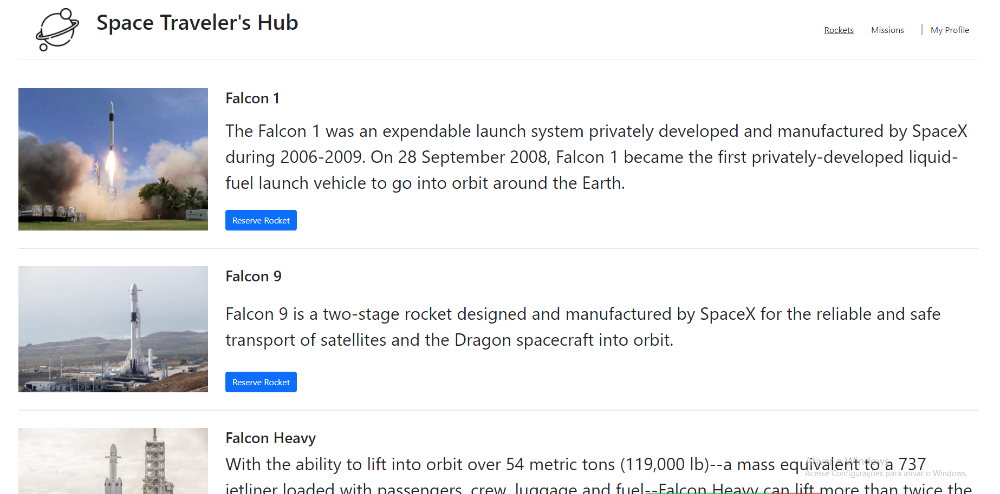

# React-Redux Space Traveler's Hub

[Video explanation of the project](https://www.loom.com/share/122ae77b47b3453797d7a9772346b447)

> A web application for a company that provides commercial and scientific space travel services. The application will allow users to book rockets and join selected space missions.

## Built With

- React
- Redux
- Git & GitHub
- VScode
- React Bootstrap

## Live Demo

[Live Demo Link](https://keen-meitner-7781f8.netlify.app)

## Getting Started

To get a local copy up and running follow these simple example steps.

### Prerequisites

- GitHub account
- Git
- Browser
- Commandline
### Setup

- To setup this repository locally please open your commandline.
- Navigate to where you want to clone the repository
- Use this command to clone it `git clone git@github.com:jmontanholi/react-space-hub.git`
- Then `cd react-space-hub`

### Install

- To install it just use the commandline and this command `npm install` or `npm i` or `yarn install`
### Usage

- To open it locally on your browser just use this command in the commandline `npm start` or `yarn start`

## Authors

👤 **Alex Arturo Guzman Cruz**

- GitHub: [@ArthurGC](https://github.com/ArthurGC)

👤 **João Vítor Montanholi Nunes**

- GitHub: [jmontanholi](https://github.com/jmontanholi)
- Twitter: [MontanholiNunes](https://twitter.com/MontanholiNunes)
- LinkedIn: [Joao vitor montanholi](https://www.linkedin.com/in/joaovitormontanholi/)

## 🤝 Contributing

Contributions, issues, and feature requests are welcome!

Feel free to check the [issues page](../../issues/).

## Show your support

Give a ⭐️ if you like this project!

## Acknowledgments

- Microverse

## 📝 License

This project is [MIT](./MIT.md) licensed.
